# obi-cordic-accel

[](https://github.com/danieltyukov/obi-cordic-accel/actions/workflows/ci.yml)
[](LICENSE)

A pipelined CORDIC arithmetic accelerator with an OBI subordinate register
interface, built as a drop-in `user_domain` peripheral for the
[Croc](https://github.com/pulp-platform/croc) open-source RISC-V SoC.

Eleven functions from one datapath with no multiplier anywhere in it: **sin, cos,
atan2, magnitude, sinh, cosh, atanh, exp, ln, multiply, divide**. All three CORDIC
coordinate systems, both micro-rotation modes, full four-quadrant argument handling,
and two interchangeable microarchitectures that produce bit-identical results.

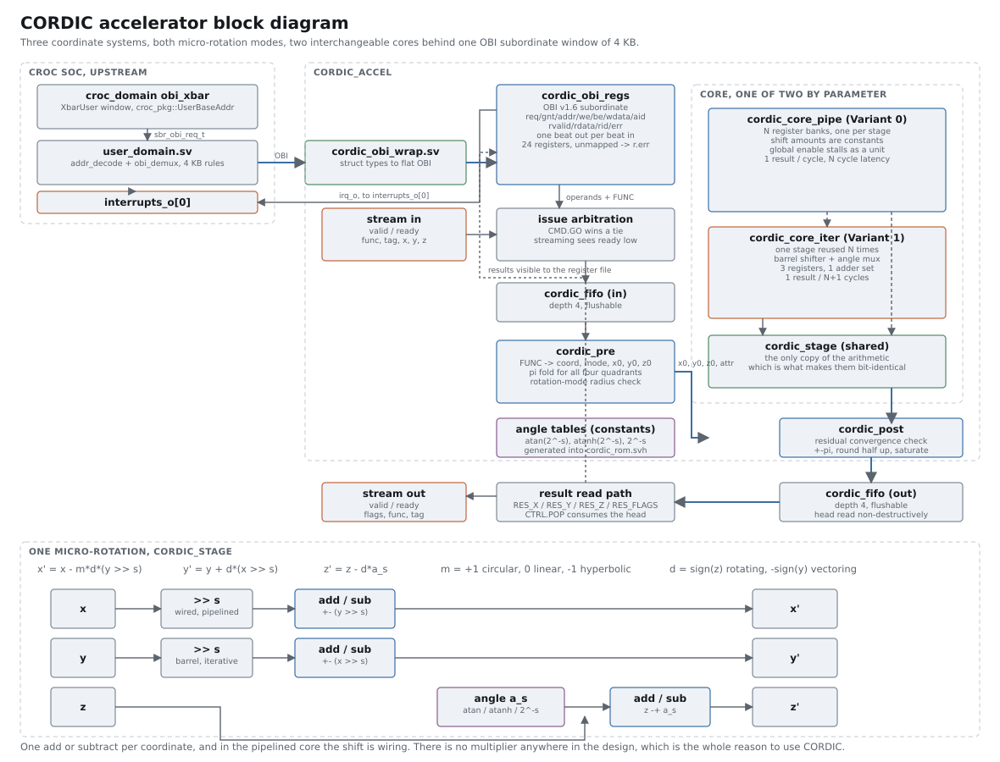

## At a glance

| | |
|---|---|
| Functions | 11, across circular, linear and hyperbolic coordinates, rotation and vectoring |
| Format | Q3.29 in 32 bits by default, parameterised; Q3.13 in 16 bits also verified |
| Accuracy | 4.5 LSB worst case for sin and cos, 1.5 RMS, measured against double precision |
| Interfaces | OBI v1.6 subordinate over a 4 KB window, plus a valid/ready streaming port |
| Pipelined core | 1 result per cycle, 78.6 MHz post-route, 1.954 mm2 of die on IHP 130nm |
| Iterative core | 1 result per 29 cycles, 90.9 MHz post-route, 0.383 mm2, 5.1x smaller |
| Silicon | Real IHP SG13G2 130nm, the process Croc taped out in. Both variants routed to GDS and LVS clean; the folded one is DRC clean and the pipelined one has one Metal2 minimum-area violation. Area in um2 and Fmax at three corners |
| Verification | 80 tests, 0 failures: 17,536 accuracy comparisons, 4,237 domain arguments, 28 OBI protocol tests, bit-identity between both cores over 900 operations, plus 13 concurrent assertions in the RTL |
| Tooling | Verilator lint clean at `-Wall` over 10 configurations, Yosys plus OpenROAD over 6, both RV32 driver images link |

## Contents

- [Why](#why)
- [Functions](#functions)
- [Accuracy](#accuracy)
- [Register map](#register-map)
- [The two microarchitectures](#the-two-microarchitectures)
- [Streaming](#streaming)
- [Silicon: real IHP 130nm](#silicon-real-ihp-130nm)
- [Routed: what synthesis got wrong](#routed-what-synthesis-got-wrong)
- [Synthesis](#synthesis)
- [Software](#software)
- [Simulating and testing](#simulating-and-testing)
- [Repository layout](#repository-layout)
- [What this does not claim](#what-this-does-not-claim)
- [Licence](#licence)

## Why

CVE2, the core Croc ships with, is RV32IMC with no FPU and no divider worth the
name. Anything trigonometric, hyperbolic or logarithmic costs hundreds of cycles in
software. CORDIC computes all of it with shifts and adds, one bit of the answer per
micro-rotation, so an accelerator that fits in a few thousand gates can replace a
whole libm.

The single recurrence that makes that work, for stage `s` with shift `s` and
micro-rotation angle `a_s`:

```
x' = x - m*d*(y >> s)      m = +1 circular, 0 linear, -1 hyperbolic
y' = y +   d*(x >> s)      d = sign(z) rotating, -sign(y) vectoring
z' = z -   d*a_s
```

`rtl/cordic_stage.sv` is that, and nothing else. Both cores instantiate the same
module over the same sequence, which is why they are bit-identical rather than
merely equivalent.

**No multiplier** is not a claim here, it is an assertion. `make arith` stops Yosys
before cell mapping and asserts `$mul`, `$div`, `$mod`, `$pow` and `$macc` are all
absent, then prints what the design does infer:

| Configuration | Arithmetic inferred |
|---|---|
| pipelined Q3.29 N=28 | mux 366, add 95, sub 89, pmux 45, neg 8 |
| iterative Q3.29 N=28 | mux 252, add 15, sub 8, pmux 9, neg 8, **sshr 2** |

Which is the architecture in one line: the folded core has a sixth of the adders and
the only two real shifters in the design, because the pipelined core's shift amounts
are constants and compile away to wiring.

## Functions


| `FUNC` | Name | System | Mode | Operands | Result | Convergence domain | Gain |
|-------:|------|--------|------|----------|--------|--------------------|------|
| 0 | `SIN_COS` | circular | rotation | Z = angle in radians | X = cos(Z), Y = sin(Z) | whole representable range of Z | compensated, x0 preloaded with 1/K |
| 1 | `ROTATE` | circular | rotation | X, Y = vector, Z = angle | X, Y = K * R(Z) * (X,Y) | whole representable range of Z | exposed as K_CIRC |
| 2 | `ATAN2` | circular | vectoring | X, Y = vector | Z = atan2(Y,X), X = K * hypot(X,Y) | all four quadrants, no restriction | Z exact, X scaled by K_CIRC |
| 3 | `SINH_COSH` | hyperbolic | rotation | Z = argument | X = cosh(Z), Y = sinh(Z) | \|Z\| <= LIM_HYP | compensated, x0 preloaded with 1/Kh |
| 4 | `HROTATE` | hyperbolic | rotation | X, Y = vector, Z = argument | X, Y = Kh * Rh(Z) * (X,Y) | \|Z\| <= LIM_HYP | exposed as K_HYP |
| 5 | `ATANH` | hyperbolic | vectoring | X, Y = vector | Z = atanh(Y/X), X = Kh * sqrt(X^2 - Y^2) | X != 0 and \|Y/X\| <= TANH_LIM_HYP | Z exact, X scaled by K_HYP |
| 6 | `EXP` | hyperbolic | rotation | Z = exponent | X = Y = exp(Z) | \|Z\| <= LIM_HYP | compensated, x0 = y0 = 1/Kh |
| 7 | `LN` | hyperbolic | vectoring | X = argument | Z = ln(X) | X > 0 and (X-1)/(X+1) within TANH_LIM_HYP | exact, no gain |
| 8 | `MUL` | linear | rotation | X, Z = factors | Y = X * Z | \|Z\| <= LIM_LIN | none, gain is 1 |
| 9 | `DIV` | linear | vectoring | Y = numerator, X = denominator | Z = Y / X | X != 0 and \|Y/X\| <= LIM_LIN | none, gain is 1 |

`FUNC` codes 10 to 31 are unassigned and are reported through
`RES_FLAGS.DOMAIN_ERR` rather than quietly computed.

The convergence constants, exactly as the hardware reports them for the default 28
stages:

| Register | Value (Q3.29) | Decimal | Meaning |
|----------|--------------:|--------:|---------|
| `K_CIRC` | 884097682 | 1.6467602588 | circular gain, `prod sqrt(1 + 2**-2s)` |
| `IK_CIRC` | 326016437 | 0.6072529349 | `1/K`, preloaded for gain-free sin and cos |
| `K_HYP` | 444614671 | 0.8281593602 | hyperbolic gain, `prod sqrt(1 - 2**-2s)` |
| `IK_HYP` | 648270052 | 1.2074970677 | `1/Kh`, preloaded for sinh, cosh and exp |
| `LIM_CIRC` | 935919873 | 1.7432866115 | `sum atan(2**-s)`, 99.88 degrees |
| `LIM_HYP` | 600314558 | 1.1181729995 | `sum atanh(2**-s)` |
| `LIM_LIN` | 1073741820 | 1.9999999925 | `sum 2**-s` |
| `TANH_LIM_HYP` | 433218581 | 0.8069324885 | `tanh(LIM_HYP)`, largest `abs(Y/X)` for atanh |

Two things about that table are worth spelling out.

**Full four quadrants, no error case.** The bare circular recurrence reaches only
`LIM_CIRC`, about 99.9 degrees, so quadrants two and three are unreachable. Since
`R(z) = R(z - pi) * R(pi)` and `R(pi) = -I`, subtracting pi and negating the initial
vector fixes it for one subtract and two negations. After the fold the residual angle
never exceeds 1.5708 rad, inside the 1.7433 radius, so **every representable angle
converges** and `SIN_COS` has no error case at all.
`tb/test_domain.py::test_circular_never_errors` asserts that over 1,219 arguments
spanning the whole word. Vectoring covers all four quadrants the same way, by
negating a negative x and adding back the appropriate `+-pi`.

**The radii read back exactly.** `LIM_HYP` is quantised down to the interface format,
so the value software reads is exactly the largest argument the hardware accepts.
Rounding to the internal format first left the register's own value one LSB out of
range and rejected, which the domain test caught.

Everything about the theory, including why hyperbolic iterations 4 and 13 have to
repeat and which stage counts that makes legal, is in [docs/DESIGN.md](docs/DESIGN.md).

## Accuracy

Measured on the RTL against `math` in double precision, 17,536 comparisons. Every
result is separately asserted bit-exact against the model, so these numbers are
accuracy, not correctness. In LSBs of Q3.29, where one LSB is 1.863e-9:

| Function | Output | n | Max error | RMS | Asserted bound |
|----------|--------|--:|----------:|----:|---------------:|
| `SIN_COS` | cos | 1816 | **4.49** | 1.54 | 12 |
| `SIN_COS` | sin | 1816 | **4.34** | 1.82 | 12 |
| `ATAN2` | atan2 | 1164 | **5.33** | 2.37 | 24 |
| `ATAN2` | K*hypot | 1164 | **1.18** | 0.47 | 24 |
| `ROTATE` | x | 1205 | **14.37** | 3.77 | 48 |
| `ROTATE` | y | 1205 | **15.11** | 3.78 | 48 |
| `SINH_COSH` | cosh | 611 | **10.32** | 3.44 | 24 |
| `SINH_COSH` | sinh | 611 | **13.53** | 5.72 | 24 |
| `EXP` | exp | 611 | **23.39** | 6.74 | 40 |
| `HROTATE` | x | 1205 | **11.31** | 3.08 | 64 |
| `HROTATE` | y | 1205 | **10.36** | 3.01 | 64 |
| `ATANH` | atanh | 1210 | **9.73** | 4.66 | 64 |
| `ATANH` | Kh*sqrt | 1210 | **1.40** | 0.41 | 48 |
| `LN` | ln | 608 | **19.20** | 9.57 | 48 |
| `MUL` | product | 611 | **17.00** | 5.00 | 24 |
| `DIV` | quotient | 524 | **5.55** | 2.34 | 32 |

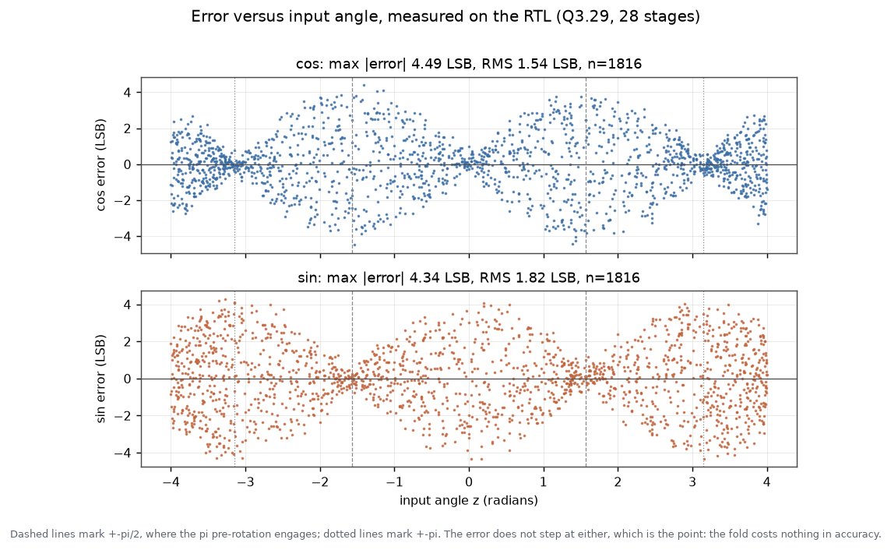

The error does not step at `+-pi/2` where the fold engages, which is the point: the
quadrant handling costs nothing in accuracy.

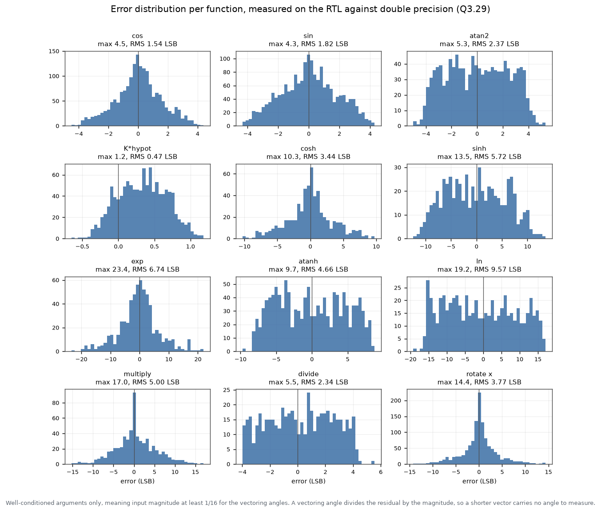

A **second, stricter bound** is asserted on every single argument, not just the
well-conditioned ones. It carries the conditioning of the operation, which matters
enormously in vectoring mode: the residual sits in `y`, and turning a y-residual into
an angle divides by the magnitude, so

```
rotation:   |error| <= R * (atan(2**-(N-1)) + N*2**-(F+G)) + 2**-F
vectoring:  |error| <= atan(2**-(N-1)) + N*2**-(F+G) / hypot(x, y)
```

which is why `atan2` of a vector a few LSBs long carries no usable angle at all, and
why the LSB figures above are quoted over the region where an angle exists (input
magnitude at least 1/16). Zero violations of the derived bound over the whole sweep;
the worst observed error came to 0.52 of it. Both forms live in
`tb/cordic_bounds.py` with the measurements that justify them.

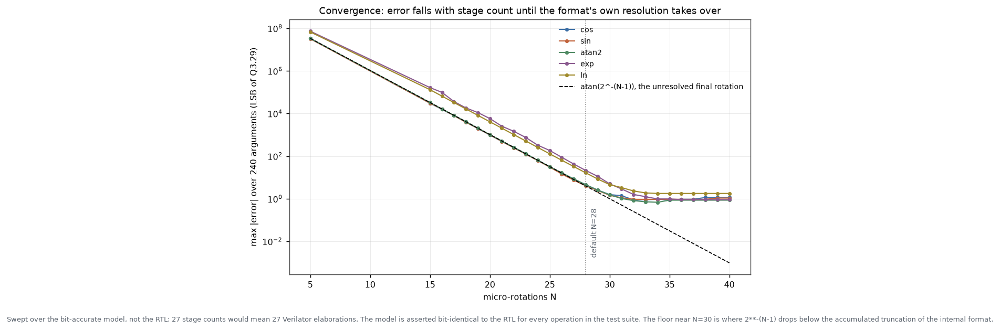

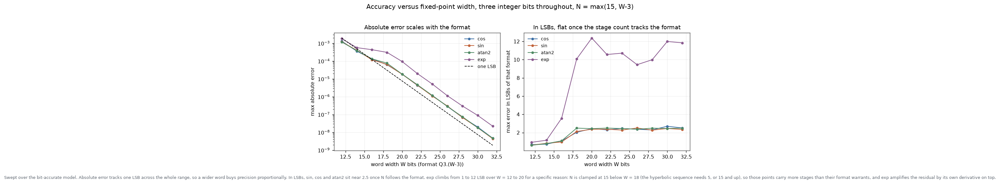

Those two sweep the bit-accurate model rather than the RTL, and say so on the
figure: 27 stage counts and 11 word widths would be that many separate Verilator
elaborations. The model is asserted bit-identical to the RTL for every operation
everywhere else in the suite.

The trajectory the datapath actually walks, read out of the iterative core's debug
port one micro-rotation at a time during simulation and asserted against the model
point by point before being plotted:

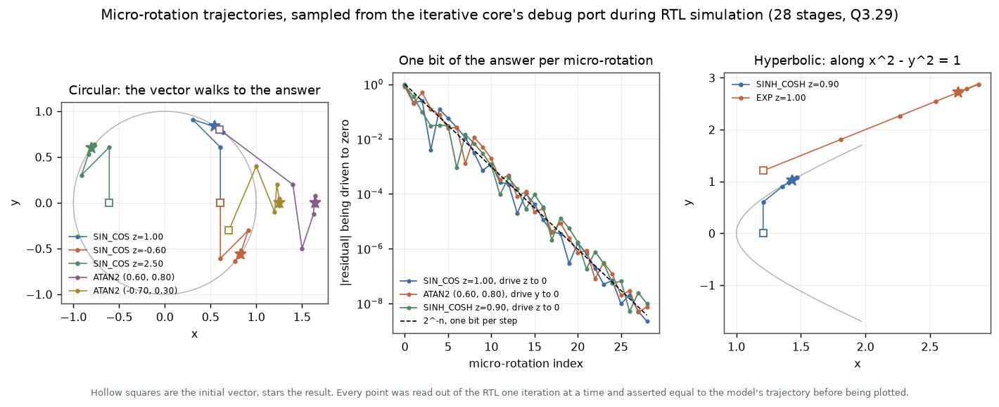

## Register map

One 4 KB window. Offsets `0x000` to `0x063` are implemented; the rest of the window
answers with `r.err` and `0xBADACCE5`, so a stray access is reported rather than
aliased.

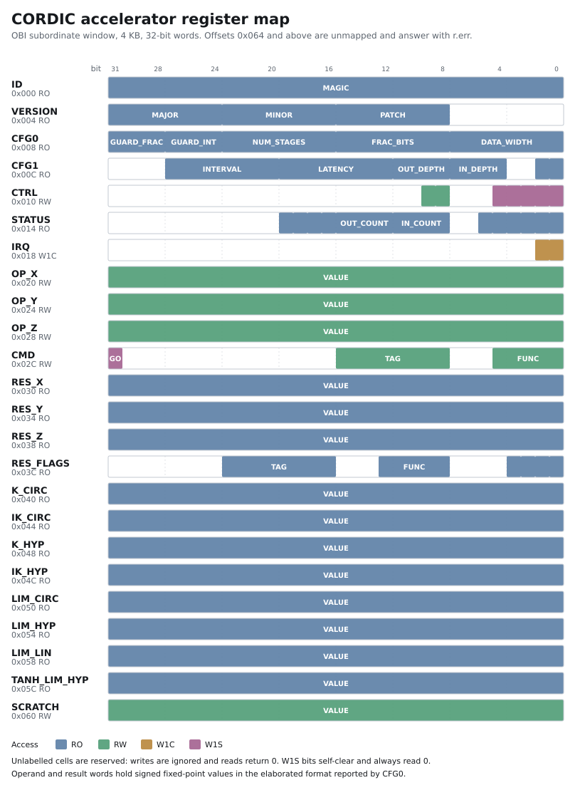


### Register summary

| Offset | Name | Access | Description |
|--------|------|--------|-------------|
| `0x000` | `ID` | RO | Identification magic, reads 0x434F5244 ("CORD") |
| `0x004` | `VERSION` | RO | Semantic version of the register interface |
| `0x008` | `CFG0` | RO | Elaborated fixed-point format |
| `0x00C` | `CFG1` | RO | Elaborated microarchitecture and timing |
| `0x010` | `CTRL` | RW | Control. Bits 0 to 4 are write-1-to-trigger and read 0 |
| `0x014` | `STATUS` | RO | Live and sticky status |
| `0x018` | `IRQ` | W1C | Interrupt status, write 1 to clear |
| `0x020` | `OP_X` | RW | Operand X in the working fixed-point format |
| `0x024` | `OP_Y` | RW | Operand Y in the working fixed-point format |
| `0x028` | `OP_Z` | RW | Operand Z in the working fixed-point format |
| `0x02C` | `CMD` | RW | Function select and issue trigger |
| `0x030` | `RES_X` | RO | Result X at the head of the output FIFO |
| `0x034` | `RES_Y` | RO | Result Y at the head of the output FIFO |
| `0x038` | `RES_Z` | RO | Result Z at the head of the output FIFO |
| `0x03C` | `RES_FLAGS` | RO | Per-result flags at the head of the output FIFO |
| `0x040` | `K_CIRC` | RO | Circular CORDIC gain K, working format |
| `0x044` | `IK_CIRC` | RO | Reciprocal circular gain 1/K, working format |
| `0x048` | `K_HYP` | RO | Hyperbolic CORDIC gain Kh, working format |
| `0x04C` | `IK_HYP` | RO | Reciprocal hyperbolic gain 1/Kh, working format |
| `0x050` | `LIM_CIRC` | RO | Circular convergence radius, working format |
| `0x054` | `LIM_HYP` | RO | Hyperbolic convergence radius, working format |
| `0x058` | `LIM_LIN` | RO | Linear convergence radius, working format |
| `0x05C` | `TANH_LIM_HYP` | RO | Largest \|Y/X\| the hyperbolic vectoring mode resolves |
| `0x060` | `SCRATCH` | RW | Read-write scratch word, no hardware effect |
| `0x064` .. `0xFFC` | unmapped | - | Reads return `0xBADACCE5` with `r.err`, writes take `r.err` |

### Bit fields

#### `VERSION` at `0x004` (RO)

| Bits | Name | Access | Description |
|------|------|--------|-------------|
| `31:24` | `MAJOR` | RO | Major version |
| `23:16` | `MINOR` | RO | Minor version |
| `15:8` | `PATCH` | RO | Patch version |
| others | reserved | RO | Read 0, writes ignored |

#### `CFG0` at `0x008` (RO)

| Bits | Name | Access | Description |
|------|------|--------|-------------|
| `31:28` | `GUARD_FRAC` | RO | Fractional guard bits of the internal datapath |
| `27:24` | `GUARD_INT` | RO | Integer guard bits of the internal datapath |
| `23:16` | `NUM_STAGES` | RO | CORDIC micro-rotations per operation |
| `15:8` | `FRAC_BITS` | RO | Fractional bits of the fixed-point word |
| `7:0` | `DATA_WIDTH` | RO | Fixed-point word width in bits |

#### `CFG1` at `0x00C` (RO)

| Bits | Name | Access | Description |
|------|------|--------|-------------|
| `27:20` | `INTERVAL` | RO | Minimum cycles between accepted operations |
| `19:12` | `LATENCY` | RO | Issue-to-result latency in clock cycles |
| `11:8` | `OUT_DEPTH` | RO | Output FIFO depth in entries |
| `7:4` | `IN_DEPTH` | RO | Input FIFO depth in entries |
| `1` | `USE_RREADY` | RO | 1 if the OBI R channel implements rready |
| `0` | `VARIANT` | RO | 0 = fully pipelined, 1 = iterative |
| others | reserved | RO | Read 0, writes ignored |

#### `CTRL` at `0x010` (RW)

| Bits | Name | Access | Description |
|------|------|--------|-------------|
| `9` | `IRQ_EN_ERR` | RW | Route IRQ.ERR to the interrupt output |
| `8` | `IRQ_EN_DONE` | RW | Route IRQ.DONE to the interrupt output |
| `4` | `CLR_ERR` | W1S | Clear the sticky STATUS.ERR_* bits |
| `3` | `FLUSH_OUT` | W1S | Drop every completed but unread result |
| `2` | `FLUSH_IN` | W1S | Drop every queued but unstarted operation |
| `1` | `POP` | W1S | Discard the result at the head of the output FIFO |
| `0` | `SOFT_RST` | W1S | Abort every operation in flight, flush both FIFOs, clear the sticky errors and the IRQ state. Operand, CMD and SCRATCH registers are left alone |
| others | reserved | RO | Read 0, writes ignored |

#### `STATUS` at `0x014` (RO)

| Bits | Name | Access | Description |
|------|------|--------|-------------|
| `19` | `ERR_ACCESS` | RO | Sticky: an unmapped, unaligned or illegal access occurred |
| `18` | `ERR_UNDERFLOW` | RO | Sticky: a result was read or popped while empty |
| `17` | `ERR_OVERFLOW` | RO | Sticky: an issue was dropped, input FIFO was full |
| `16` | `ERR_DOMAIN` | RO | Sticky: an operand was outside the convergence domain |
| `15:12` | `OUT_COUNT` | RO | Results waiting in the output FIFO |
| `11:8` | `IN_COUNT` | RO | Operations queued in the input FIFO |
| `5` | `OUT_EMPTY` | RO | Output FIFO holds no result |
| `4` | `OUT_FULL` | RO | Output FIFO cannot accept another result |
| `3` | `IN_EMPTY` | RO | Input FIFO holds no operation |
| `2` | `IN_FULL` | RO | Input FIFO cannot accept another operation |
| `1` | `RES_VALID` | RO | At least one result is readable |
| `0` | `BUSY` | RO | Operations are queued or in flight |
| others | reserved | RO | Read 0, writes ignored |

#### `IRQ` at `0x018` (W1C)

| Bits | Name | Access | Description |
|------|------|--------|-------------|
| `1` | `ERR` | W1C | One of the sticky STATUS.ERR_* bits was set |
| `0` | `DONE` | W1C | A result was pushed into the output FIFO |
| others | reserved | RO | Read 0, writes ignored |

#### `CMD` at `0x02C` (RW)

| Bits | Name | Access | Description |
|------|------|--------|-------------|
| `31` | `GO` | W1S | Queue an operation from OP_X, OP_Y, OP_Z and FUNC |
| `15:8` | `TAG` | RW | Free-form tag returned in RES_FLAGS.TAG |
| `4:0` | `FUNC` | RW | Function code, see the function table |
| others | reserved | RO | Read 0, writes ignored |

#### `RES_FLAGS` at `0x03C` (RO)

| Bits | Name | Access | Description |
|------|------|--------|-------------|
| `23:16` | `TAG` | RO | Tag supplied in CMD.TAG |
| `12:8` | `FUNC` | RO | Function code of this result |
| `3` | `SAT_Z` | RO | Result Z saturated to the format limit |
| `2` | `SAT_Y` | RO | Result Y saturated to the format limit |
| `1` | `SAT_X` | RO | Result X saturated to the format limit |
| `0` | `DOMAIN_ERR` | RO | Operand outside the convergence domain, X/Y/Z forced to 0 |
| others | reserved | RO | Read 0, writes ignored |


The map is defined once, in `scripts/cordic_regmap.py`, and generated into the RTL
offsets, the C driver header, [docs/REGISTERS.md](docs/REGISTERS.md) and the figure
above. Hardware, driver, tests and documentation cannot disagree, and `make check-gen`
fails if any of them is stale.

### OBI

Targets **OBI v1.6** (`pulp-platform/obi`, `doc/OBI-v1.6.0.pdf`) as Croc configures
it in `croc_pkg::SbrObiCfg`: 32-bit address and data, `IdWidth` 3, `BeFull = 1`,
`Integrity = 0`, `CombGnt = 0`, `UseRReady = 0`, no optional channel fields.

Signals implemented: `req`, `gnt`, `addr`, `we`, `be`, `wdata`, `aid` on the A
channel; `rvalid`, `rdata`, `rid`, `err` on the R channel.

Rules honoured, and asserted continuously by the testbench manager while every test
runs:

- a request is accepted only on `req && gnt`, and `wdata`, `be`, `we` and `aid` are
  sampled then and nowhere else, so a manager may change them freely afterwards
- exactly one R beat per accepted A beat, in order, with `rid` echoing `aid`
- at most one transaction outstanding, so ordering is structural
- with `UseRReady = 0`, `gnt` never depends on a response being consumed, so a
  manager that ignores `rready` cannot deadlock the bus

`UseRReady` is a parameter and both settings are tested. At 1 the response waits for
`rready`, which is the only configuration in which `gnt` has to fall; measured held
unchanged for 12 cycles with `gnt` low throughout, then recovering.

Error responses, each also latching `STATUS.ERR_ACCESS`: an unaligned address, an
offset above `0x063`, and a write to any of the 17 read-only registers.

## The two microarchitectures

`Variant` selects one. Both instantiate the same `cordic_stage` over the same shift
and angle sequence, so results are **bit-identical**, asserted over 900 operations by
recording both runs and diffing the files word for word.

Post-route on IHP SG13G2, which is the only comparison that settles anything. Every
frequency below is at the slow signoff corner, `nom_slow_1p08V_125C`, which is 1.08 V
and 125 C:

| | Pipelined (`Variant = 0`) | Iterative (`Variant = 1`) | Ratio |
|---|---|---|---|
| Structure | N register banks, shifts are wiring | one stage reused, barrel shifter in the loop | |
| Routed cells, Q3.29 N=28 | 54,177 | 10,840 | 5.0x |
| Flip-flops, from synthesis | 4,921 | 1,229 | 4.0x |
| Routed cell area | 0.796 mm2 | 0.179 mm2 | **4.4x** |
| Die area | 1.954 mm2 | 0.383 mm2 | 5.1x |
| Fmax, slow corner | 78.6 MHz | **90.9 MHz** | 0.86x |
| Retire interval | **1 cycle** | 29 cycles | 29x |
| Throughput | 78.6 M results/s | 3.13 M results/s | **25.1x** |
| Results/s per mm2 of cells | 98.8 M | 17.5 M | **5.6x** |
| Latency, end to end | 30 cycles | 31 cycles | |

Every row there is post-route except the flip-flop count, which is the synthesised one:
LibreLane reports sequential-cell area rather than a flop count, and the two areas,
246,292 um2 against 60,663, stand in the same 4.06x ratio, so the flops survive the
flow. Marked rather than quietly mixed in.

Folding is a worse deal than 1/N: 4.4x the cell area buys 25x the throughput, so the
pipelined core is 5.6x better per square millimetre of cells. What it does not cost is
frequency. **Post-route the folded core is the faster of the two, by 16 percent**, and
that is the opposite of what the synthesis estimate says.

Worth spelling out, because the synthesis numbers are the ones most open accelerator
repositories quote:

| Q3.29, N=28, slow corner | Pipelined | Iterative | Which is faster |
|---|---:|---:|---|
| Synthesis estimate (`make pdk`) | 61.6 MHz | 48.5 MHz | pipelined, by 27% |
| Routed, extracted parasitics | 78.6 MHz | 90.9 MHz | **folded, by 16%** |

The paths say why. The pipelined core's critical path runs from the input FIFO's read
pointer through `cordic_pre`'s pi fold into stage 0's adder, and post-route it spends
**2.69 of its 12.72 ns in buffers** the resizer had to insert to cross a die 1.4 mm on
a side. The folded core's runs from the micro-rotation counter through the shift and
angle muxes into the same carry chain, over a die 0.6 mm on a side, and spends 0.95 of
11.00 ns in buffers. Physical size is a frequency cost, and a synthesis estimate with
no placement has no way to charge for it. The throughput conclusion is unchanged, since
25x is 25x, but the frequency ranking from synthesis alone was simply wrong.

Across all six configurations, still at synthesis and labelled as such on the figure:

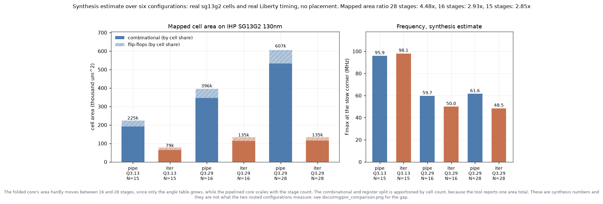

The width dependence there is worth knowing before picking a format. At Q3.13 the
estimate puts the two at the same speed (95.9 against 98.1 MHz) because a 22-bit
internal datapath needs one fewer mux level in the shifter. Only the Q3.29 pair has
been routed, so whether that holds post-route is untested, and the pair that was
routed says the estimate can get the ranking backwards.

Flow control in the pipelined core is one global enable, not per-stage skid buffers:

```systemverilog
assign pipe_en = !(vq[NumStages-1] && !ready_i);
```

The pipeline freezes as a whole when the tail holds a result the consumer will not
take. One high-fanout net instead of a ready chain through 28 stages, and nothing is
dropped, which `test_backpressure_loses_nothing` asserts under a consumer that takes
three results then stalls for seven cycles.

Measured occupancy, cell by cell from `dbg_stage_valid_o` during simulation:

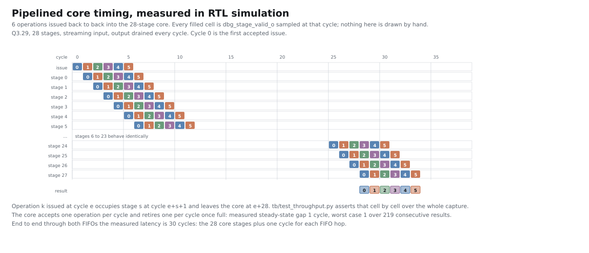

## Streaming

A register-mapped issue costs four writes and five reads. **Measured: 57 cycles per
operation.** The pipelined core retires one per cycle, so nothing reachable over a
register interface can keep it fed, whatever the pipeline does.

Hence a valid/ready streaming port in each direction, for a DMA engine or another
accelerator in the user domain:

| Path | Cycles per operation | Speedup |
|---|---:|---:|
| Registers, pipelined core | 57.0 | |
| Streaming, pipelined core | **1.94** | 29.4x |
| Registers, iterative core | 60.0 | |
| Streaming, iterative core | 29.09 | 2.1x |

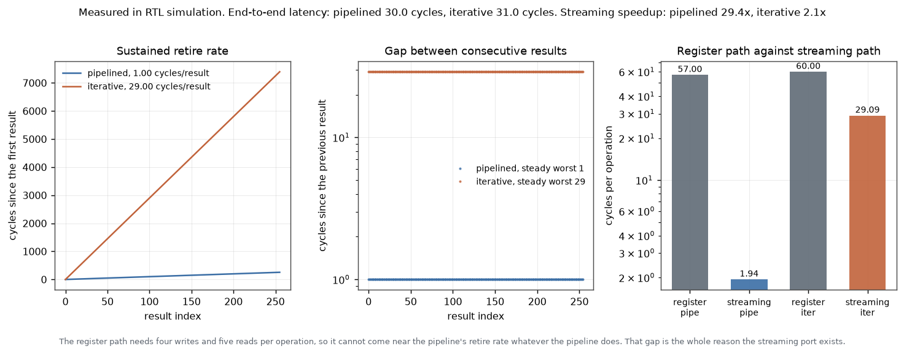

The pipelined core sustained a **retire interval of exactly 1 cycle** over 219
consecutive steady-state results, mean 1.000, worst case 1. An 8-bit `tag` travels
with each operation and comes back in `RES_FLAGS.TAG`. Both paths share the input
FIFO: a register issue wins a tie and the streaming port sees `ready` low for that
cycle. `CTRL.POP` likewise wins over the streaming output, so a result is never
handed to two consumers.

## Silicon: real IHP 130nm

`make pdk`. Yosys maps to real `sg13g2` standard cells, OpenROAD's resizer repairs
drive strength, and the one repaired netlist is timed at all three corners. Reports
under [docs/pdk/](docs/pdk/), methodology in
[docs/pdk/README.md](docs/pdk/README.md).

**Everything in this section is a synthesis estimate**, over six configurations. Two
of them have been routed as well, and where the two disagree the routed number is the
real one: see [Routed](#routed-what-synthesis-got-wrong) for the measured gap, which
runs to 1.31x on cell area and 1.88x on frequency.

| Configuration | Cells | FFs | Area | Fmax slow | typ | fast | Throughput |
|---|---:|---:|---:|---:|---:|---:|---:|
| pipelined, Q3.29, N=28 | 40,413 | 4,921 | 0.607 mm2 | 61.6 MHz | 95.3 | 197.3 | **61.6 M/s** |
| pipelined, Q3.29, N=16 | 26,398 | 3,277 | 0.396 mm2 | 59.7 MHz | 92.5 | 193.0 | 59.7 M/s |
| pipelined, Q3.13, N=15 | 14,243 | 1,988 | 0.225 mm2 | 95.9 MHz | 148.6 | 311.5 | 95.9 M/s |
| iterative, Q3.29, N=28 | 8,390 | 1,229 | 0.135 mm2 | 48.5 MHz | 75.2 | 156.5 | 1.67 M/s |
| iterative, Q3.29, N=16 | 8,064 | 1,229 | 0.135 mm2 | 50.0 MHz | 77.0 | 159.8 | 2.94 M/s |
| iterative, Q3.13, N=15 | 4,627 | 748 | 0.079 mm2 | 98.1 MHz | 150.9 | 315.3 | 6.13 M/s |

Slow corner is 1.08 V and 125 C, the one a design has to close on. Throughput is Fmax
divided by the measured issue interval, so it is a real rate, not a peak claim.

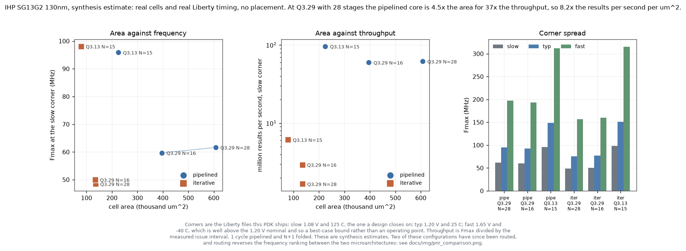

Three things in that data are worth pointing out.

**The folded core's area barely moves with the stage count.** 0.1349 mm2 at 16 stages
against 0.1354 mm2 at 28, a 1.004x increase for 1.75x the micro-rotations, because
only the angle table and its mux grow. The pipelined core scales 1.535x over the same
change. That is the textbook property of folding, measured rather than asserted.

**Both variants' critical path is the adder's carry chain.** 42 of 55 cells on the
pipelined path are AOI/OAI pairs, which is what a ripple carry maps to, and 36 of 52
on the folded one. Not the shift network, not the angle lookup. `abc` maps the adders
to ripple carry, so a carry-select or carry-lookahead structure is the single change
that would lift both variants; the comparison between them is unaffected, since both
go through the identical flow.

**The paths end where the analysis says they should.** The pipelined path runs from
the input FIFO's read pointer to `i_unit.gen_pipelined.i_core.xq[36]`, so it covers
the FIFO read, `cordic_pre`'s pi fold and stage 0's adder in one cycle: three adds in
series. The folded path runs from the coordinate-system bit of the attribute register
to `i_unit.gen_iterative.i_core.xr_q[37]`, through the shift and angle muxes into the
same carry chain. Registering `cordic_pre` would shorten the first; nothing shortens
the second without unfolding.

Post-route both paths keep their character and one of them moves. The pipelined path
still starts at `i_in_fifo.rptr_q[0]` and now ends at stage 1's `y_i[37]`. The folded
path starts at the micro-rotation counter instead of the attribute register, still
through the shift and angle muxes into the same adder. Same story, different register
feeding it.

## Synthesis

`make synth` also keeps a technology-independent Yosys run (`abc -g cmos4`) under
[docs/synth/](docs/synth/), and CI fails if the committed reports differ from a fresh
one. Those are gate equivalents rather than areas, so the real-silicon table above is
what the README quotes; the generic run is kept because it is what someone without
the PDK can reproduce, and because the following checks are asserted inside the Yosys
script itself rather than appearing in a report nobody reads:

- **no inferred latches** anywhere: `$dlatch`, `$_DLATCH_*`, `$sr` and `$_SR_*` all
  asserted empty, before and after technology mapping
- **no blackboxes**: `hierarchy -check` plus a check that every remaining cell is a
  Yosys primitive
- `check -assert`: no combinational loop, no multiply-driven wire, no undriven wire
- no unmapped memory, no tristate

## Routed: what synthesis got wrong

`make pnr` then `make layout`. Both variants at Q3.29 with 28 stages, taken from RTL
to GDS through LibreLane on IHP SG13G2. The two frames below cover identical
micrometres of silicon, so the folded die is smaller in the figure because it is
smaller on the wafer:

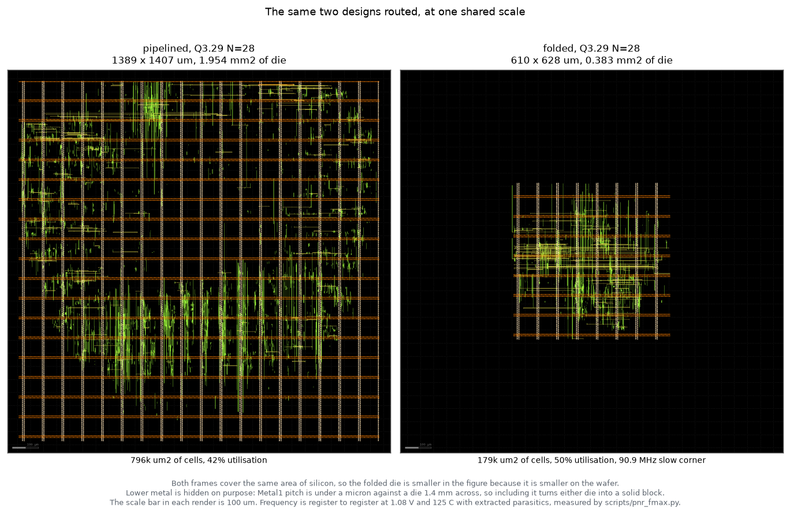

Metal4 and above only. Metal1 pitch is under a micron against a die 1.4 mm across, so
including the lower layers turns either die into a solid block. For structure below
that, crop instead: 12 um of the pipelined die with every layer on, where the cell
rows, the poly gates, the contacts and the local routing are individually legible.

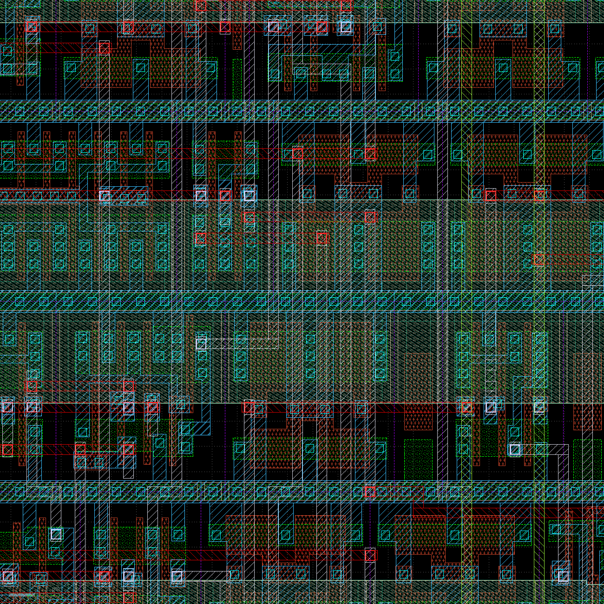

### The synthesis-to-route delta

This is the part worth reading, because synthesis numbers are what most open
accelerator repositories quote as if they were final. They are not, and they are not
wrong in a single direction either.

Both frequency rows are at the slow signoff corner, 1.08 V and 125 C, named
`nom_slow_1p08V_125C` in the LibreLane metrics and `slow` in
[docs/pdk/summary.json](docs/pdk/summary.json). The area rows come from
`design__instance__area__stdcell` and `design__die__area` in
[docs/pnr/summary.json](docs/pnr/summary.json) and from `synth_area_um2` in the PDK
summary, so every cell in this table can be checked against a committed file without
rerunning anything.

| Q3.29, N=28 | Pipelined | Iterative |
|---|---:|---:|
| Mapped cell area, synthesis | 607,386 um2 | 135,442 um2 |
| Routed standard cell area, post-route | 795,596 um2 | 179,054 um2 |
| **Cell area inflation** | **1.31x** | **1.32x** |
| Die area, post-route | 1,954,180 um2 | 383,154 um2 |
| Die / mapped cells | 3.22x | 2.83x |
| Utilisation achieved, post-route | 42.0% | 50.1% |
| Fmax slow, synthesis estimate | 61.6 MHz | 48.5 MHz |
| Fmax slow, post-route | 78.6 MHz | 90.9 MHz |
| **Frequency change** | **1.28x** | **1.88x** |

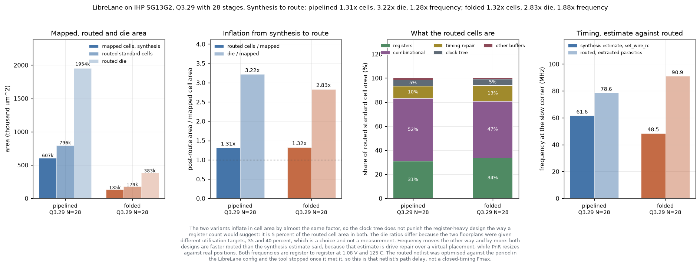

**Area: synthesis understates it, by 1.31x on the cells and about 3x on the die.** The
die figure is the one to be careful with. Most of it is the utilisation target the
floorplan was given, 35 percent for the pipelined variant and 40 for the folded one,
which is a designer's choice rather than a measurement, and it is why the two die
ratios differ while the cell ratios do not.

**Both variants inflate in cell area by the same factor**, 1.31x against 1.32x. That is
worth stating because the obvious hypothesis is the opposite: the pipelined core has
four times the registers, so its clock tree should punish it harder. Measured, the
clock tree is 5.2 percent of routed cell area in the pipelined variant and 5.2 percent
in the folded one. What differs is timing repair, 10 percent of cell area pipelined
against 13 percent folded, and it goes the other way. A synthesis-only area comparison
between these two microarchitectures is fair.

**Timing: synthesis understates it, and not by the same factor.** Both designs are
faster routed than the estimate said, the folded one by 1.88x and the pipelined one by
1.28x. The natural explanation is that `set_wire_rc -layer Metal2` is pessimistic, and
it is the wrong one. `scripts/pnr_fmax.py` checks it by re-timing each **routed**
netlist under that same estimate, which holds the netlist fixed and varies only the
wire model:

| Slow corner, reg-to-reg | Pipelined | Iterative |
|---|---:|---:|
| Routed netlist, extracted parasitics | 12.72 ns | 11.00 ns |
| Routed netlist, `set_wire_rc` estimate | 9.63 ns | 8.93 ns |
| The estimate is | 1.32x optimistic | 1.23x optimistic |

On a fixed netlist the estimate runs optimistic, not pessimistic. So the gap is in the
netlist rather than the wire model: `make pdk` does drive repair over a virtual
placement, while PnR places, builds a clock tree and then resizes against real
positions, and the folded core's mux-heavy critical path responds to that far better
than the pipelined core's carry chain does.

Which is how a synthesis-only comparison came to rank the two variants the wrong way
round on frequency. See [docs/pnr/README.md](docs/pnr/README.md) for why the routed
frequency has to be measured separately rather than divided out of LibreLane's
leftover slack, and for what that number does and does not claim.

### Signoff

| Check | Pipelined | Iterative |
|---|---|---|
| Router DRC, iterated to convergence | 0 | 0 |
| Magic DRC, sg13g2 runset | **7** | 0 |
| KLayout DRC, sg13g2 runset, 477 rules | **1** | 0 |
| Magic against KLayout GDS XOR | 0 | 0 |
| netgen LVS, extracted against netlist | circuits match uniquely | circuits match uniquely |
| LVS unmatched nets, devices, pins | 0, 0, 0 | 0, 0, 0 |
| Antenna violations after diode insertion | 13 | 6 |
| Routed wirelength | 1,685,814 um | 418,654 um |
| Total power, OpenSTA estimate at typ | 0.117 W | 0.018 W |

**The folded variant closes DRC clean and the pipelined one does not.** Both variants
pass LVS: netgen reports circuits match uniquely against the extracted layout, with no
unmatched net, device or pin on either.

The power figures are the weakest numbers in that table and are labelled accordingly.
They are OpenSTA's own estimate over the routed netlist with its default switching
activity, not a simulation-driven one, so the 6.5x ratio between the variants carries
more than either absolute value does.

The two DRC decks agree on what is wrong. KLayout reports exactly one violation on the
pipelined layout, a Metal2 minimum-area failure (`M2.d`). Magic reports 7 in the raw
count it warns should be divided by three or four, and they are the same `M2.d` spot
near (704.5, 467.4) um plus two tie extensions beyond a diffusion contact (`LU.c`) that
KLayout's deck does not flag. So: one real minimum-area sliver that two independent
tools found, and a tap-cell rule that one of them applies. Neither is in the deck
OpenROAD's own router checks, which is why the router converged to zero and the signoff
decks did not. Neither is designed in: they are artefacts of this flow configuration on
a die five times the area, and clearing them means another routing run, not an RTL
change.

Magic's DRC is single-threaded whatever the flow is told, and it scales badly: 7
minutes 43 seconds for the folded variant's 30k instances against 2 hours 7 minutes for
the pipelined variant's 166k. That is the single reason the pipelined variant took most
of a day to get through signoff.

## Software

A freestanding baremetal driver: no libc, no floating point, no allocation. Croc's
CVE2 has no FPU, so a float in a driver would pull in soft-float routines costing more
than the accelerator saves.

```c
#include "cordic.h"

cordic_t dev;
cordic_init(&dev, 0x20001000u);           /* probes ID, caches CFG and the gains */

cordic_fx_t s, c;
cordic_sin_cos(&dev, cordic_fx_from_ratio(&dev, 1, 2), &s, &c);   /* z = 0.5 */

cordic_fx_t q;
if (cordic_div(&dev, num, den, &q) == CORDIC_ERR_DOMAIN) {
  /* den was zero or the quotient exceeded LIM_LIN */
}
```

Three call styles plus a named wrapper per function:

- `cordic_submit` / `cordic_poll`, non-blocking; queue work and come back for it
- `cordic_exec`, blocking, one operation
- `cordic_exec_batch`, blocking, keeps the input queue as full as it will go

`cordic_hypot` and `cordic_rotate` divide the gain out for you; call `cordic_exec`
with the raw function code to keep the scaled value.

Verified by building the identical source two ways. `make sw` compiles it against a
register-accurate peripheral model and runs it: **626 checks, 0 failures**, covering
register sequencing, non-destructive reads followed by `POP`, flag decoding, gain
compensation, queue-full back-off, batching, underflow, domain errors and the
interrupt path. The model answers out of vectors generated from the same bit-accurate
model the RTL is asserted against, rather than from a second CORDIC written in C.

`make sw` also links a complete RV32IMC image, 7,428 bytes of text, which fits stock
Croc's 8 KB SRAM with a 512-byte stack. **It is not executed:** this repository has no
Croc simulation. It records its outcome at the `cordic_test_report` symbol and returns
the failure count in `a0` so Croc's own testbench can read the result out of memory.
`sw/README.md` has the details.

That host test earned its keep immediately: it found that writing `CTRL` as a whole
word to fire `POP` also cleared the interrupt enables, since they share the register.
`CTRL` now keeps its triggers in byte 0 and its enables in byte 1 and the driver uses
byte stores, which is what the byte-enable support in `cordic_obi_regs` is for.

## Simulating and testing

```sh
make venv        # .venv plus requirements
make lint        # Verilator -Wall, 10 configurations plus the Croc wrapper
make test        # the whole suite, both variants, both OBI handshakes
make synth       # Yosys generic cells, 6 configurations
make pdk         # real IHP SG13G2 130nm: um2 and MHz at three corners
make pnr         # full RTL-to-GDS, both variants: post-route area, DRC and LVS
make layout      # render the routed dies at a shared scale, plus detail crops
make sw          # host driver test (runs) and RV32 images (link)
make images      # redraw every figure from the measured data
make all         # all of the above
```

| Target | What it establishes |
|---|---|
| `test-accuracy` | 17,536 comparisons against double precision, plus bit-exact against the model |
| `test-domain` | 4,237 in-domain arguments never rejected; every out-of-domain one rejected with zeroed outputs; the ambiguous band measured |
| `test-obi` | 14 tests in each handshake configuration, 28 total |
| `test-throughput` | Retire interval asserted against what `CFG1` advertises, per-stage occupancy checked cell by cell |
| `test-equivalence` | Both cores' results diffed word for word |
| `test-reset` | Reset with a full pipeline, busy, sticky done, queueing, overflow, interrupts |

Alongside those, **13 concurrent assertions** live in the RTL and are evaluated in
every simulation through Verilator's `--assert`: the OBI rules in
`cordic_obi_regs.sv`, the FIFO invariants in `cordic_fifo.sv`, and two properties in
`cordic_core_pipe.sv` aimed at the global-enable scheme, since its whole claim is
that a stalled consumer costs throughput and nothing else. Asserting them inside the
RTL means they hold in Croc's own testbench too, without that testbench having to
know the rules.

**Simulator, stated plainly: Verilator only.** Icarus Verilog 12 cannot build this
design, aborting with an internal assertion (`netmisc.cc:1821`) when a constant
function indexes a packed 2D localparam, and separately folding `$atan` in a constant
function to zero without complaining. Verilator 5.020 is what is installed here and
cocotb 2.0 needs 5.036, so `requirements.txt` pins cocotb 1.9.2; `tb/cordic_tb.py`
carries two shims so the suite runs unchanged on either cocotb generation.

Waveforms: `make -C tb WAVES=1 MODULE=test_smoke`.

[CONTRIBUTING.md](CONTRIBUTING.md) has the rest: running one suite at a time, the
elaboration parameters as environment variables, the PDK and PnR flows, the STA
gotchas that cost an afternoon each, and the bar a change has to clear before it
lands.

## Repository layout

```
rtl/                       9 modules plus 4 include files, no external dependencies
  cordic_stage.sv          the only copy of the arithmetic
  cordic_core_pipe.sv      fully pipelined
  cordic_core_iter.sv      iterative, shares cordic_stage
  cordic_pre.sv            function decode, the pi fold, rotation-mode radius checks
  cordic_post.sv           residual convergence check, rounding, saturation
  cordic_unit.sv           pre + core + post
  cordic_fifo.sv           local, so the repository stands alone
  cordic_obi_regs.sv       OBI v1.6 subordinate
  cordic_accel.sv          top level
  cordic_rom.svh           generated constant tables
  cordic_regmap.svh        generated offsets
integration/croc/          drop-in wrapper, example user_pkg and user_domain,
                           Bender fragment, and stand-in Croc packages for lint
tb/                        cocotb suite, the bit-accurate model, the error bounds
sw/                        driver, self-test, host peripheral model, RV32 build
scripts/                   constant and register-map generators, synthesis, figures
formal/                    SymbiYosys miter and OBI properties, and what came of them
docs/                      DESIGN.md, CROC_INTEGRATION.md, REGISTERS.md, img/, synth/,
                           pdk/, pnr/
CONTRIBUTING.md            how to run every flow here, and what a change has to clear
```

Everything generated is committed and `make check-gen` fails if any of it is stale,
so a clone needs no generator run to build.

## What this does not claim

- **The RV32 image is never executed here.** It compiles and links; running it needs
  Croc's own testbench.
- **The IHP table under [Silicon](#silicon-real-ihp-130nm) stops after synthesis and
  drive repair.** Wire parasitics are estimated by `set_wire_rc`, not extracted,
  because there is no placement. Both variants at Q3.29 N=28 have been routed the rest
  of the way and those numbers are reported separately under
  [Routed](#routed-what-synthesis-got-wrong), labelled as post-route wherever they
  appear, because a synthesis estimate and a routed measurement are not
  interchangeable and here they differ by up to 1.88x. The other four configurations
  have not been routed.
- **Nothing has been fabricated.** These are tool outputs on a real PDK, not a
  tapeout. The design has no pad ring and has had no analog or reliability signoff.
- **The pipelined variant does not close DRC.** Its router DRC converges to zero and
  it passes LVS, but the Magic and KLayout signoff decks each find a Metal2
  minimum-area violation, and Magic finds two tie extensions on top. The folded
  variant is clean on every check. Both are reported above rather than rounded to
  "DRC clean".
- **The post-route frequencies are the routed netlists' path delays, not closed
  timing.** Each netlist was optimised against the period in its LibreLane config and
  the tool stopped once it met it, so a tighter target would have produced a different
  netlist. [docs/pnr/README.md](docs/pnr/README.md) has the full statement.
- **Fmax is limited by ripple-carry adders.** That is a property of `abc`'s mapping,
  not of the architecture, and it is stated rather than worked around. Both variants
  are affected identically, so the comparison holds.
- **There is no formal result.** `formal/` holds a SymbiYosys equivalence miter and a
  set of OBI protocol properties, both written and both elaborating, and the solver
  runs out of time on every configuration attempted. Each attempt is recorded with its
  bound and its wall clock in [formal/README.md](formal/README.md). Nothing above
  depends on it.
- **Icarus Verilog does not work.** Not a limitation of the tool's SystemVerilog
  coverage in general, but two specific defects documented in
  [docs/DESIGN.md](docs/DESIGN.md).
- **The vectoring-mode angle bounds are conditional on magnitude.** The LSB figures
  in the accuracy table hold for input magnitudes of at least 1/16. Below that an
  angle genuinely does not exist in the format, and the derived bound, which is
  asserted on every argument, says so quantitatively.

## Licence

Apache-2.0, copyright 2026 Daniel Tyukov. See [LICENSE](LICENSE).

The example `user_pkg.sv` and `user_domain.sv` under `integration/croc/` reproduce
scaffolding from `pulp-platform/croc`, which is Solderpad SHL-0.51; only the
CORDIC-specific parts of those two files are covered by this repository's licence.
`integration/croc/lint/obi_pkg.sv` and `croc_pkg.sv` reproduce field lists from the
same source for the purpose of linting the integration wrapper.
